# 프로젝트 포트폴리오

Sep 30, 2026 · @Uranium

2026년 4월부터 9월까지의 공개 저장소 25개와 팀 저장소를 기준으로, 대표작 네 개와 그 밖의 작업을 정리했습니다. 각 프로젝트에는 제 역할과 아직 검증하지 못한 부분을 함께 적었습니다.

아래 이미지는 배포 사이트 또는 로컬에서 직접 실행해 촬영한 화면입니다. [촬영 환경과 확인 범위](SCREENSHOTS.md)에서 각 이미지의 출처와 실행 조건을 확인할 수 있습니다.

## 한눈에 보기

| 프로젝트 | 한 줄 소개 | 내 역할 | 상태 |
| --- | --- | --- | --- |
| 도란도란 | 아이의 읽기 수준에 맞춰 전래동화를 다시 써 주는 AI 서비스 | 팀 개발자로서 백엔드와 프론트엔드 개발 중심 | 운영 중, 통합본선 발표 후 결과 대기 |
| BiddingFlow | 견적 요청부터 발주까지 구매 업무를 자동화하는 AI 플랫폼 | 팀에서 프론트엔드, 업무 흐름 API, 배포 자동화 | 팀 최종 프로젝트, 배포 구성 완료 |
| USD | 7일 안에 빚을 갚아야 하는 주식 생존 게임 | 기획부터 구현·배포까지 | 배포됨, 토큰 비용 때문에 공개 보류 |
| 치매정보알리미 | 보호자의 걱정을 듣고 치매안심센터와 대처 방법을 안내하는 AI 서비스 | 프론트엔드와 API 연동 | 배포됨 |
| MiniStudio | 음악을 만드는 데스크톱 프로그램 | 기획과 검증 | 아직 미완성, 만드는 중 |

## 도란도란 — 아이 수준에 맞춰 다시 써 주는 전래동화

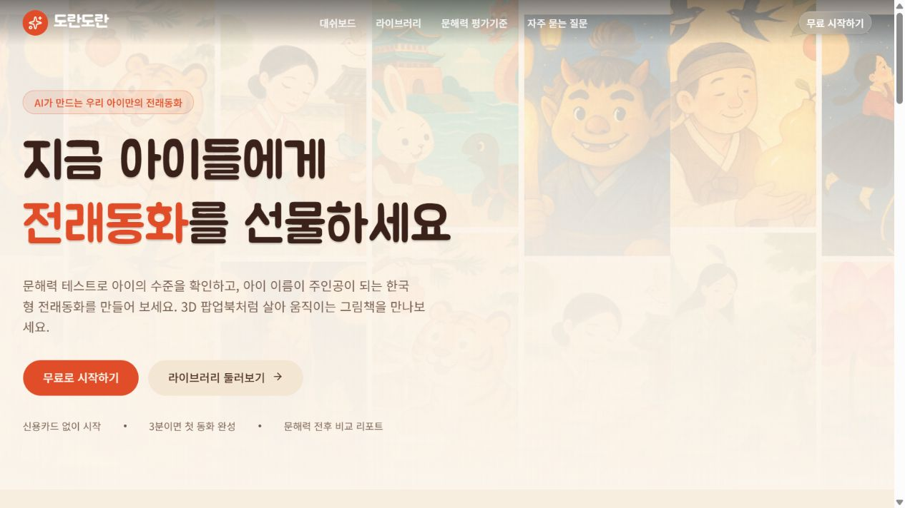

*배포 서비스의 공개 첫 화면. 동화 생성과 개인 책장은 로그인이 필요합니다.*

**도란도란은 공공데이터 속 우리 설화를 아이의 지금 읽기 수준에 맞는 이야기로 다시 들려주는 전래동화 생성 서비스입니다.** 2026년 6월에 시작해 서비스로 운영하고 있으며, 9월 30일 범정부 공공데이터·AI 활용 창업경진대회 통합본선에서 발표했습니다(결과 대기).

**풀려는 문제.** 책 표지에는 "5세"라고만 적혀 있어서, 부모는 우리 아이 수준에 맞는 책을 고를 수 없습니다. 도란도란은 수준을 재고, 그 수준에 맞는 이야기를 매일 한 편씩 줍니다.

**만든 것**

- 20단계 문해력 기준: 단계마다 문장 길이, 어휘 등급, 문법, 분량을 정해 AI의 생성 규칙 하나로 묶었습니다.
- 공공데이터 두 축: 국립국어원 기초어휘 약 1만 3천 개의 등급으로 어휘 수준을 통제하고, 설화 원전 195편으로 인물·사건·결말이 지어내지지 않게 붙잡습니다.
- 생성 과정: 원전을 찾고 다섯 장면을 먼저 설계한 뒤, 후보 두 편 중 더 자연스럽고 단계에 맞는 쪽을 AI가 고릅니다. 퀴즈, 삽화, 낭독은 그 뒤에 함께 만들어집니다.
- 아이가 그린 그림으로 동화 만들기, 부모용 대시보드와 책장, 퀴즈 보상 스티커, 부모의 관찰 메모를 다음 이야기에 반영하는 기능.

**내 역할.** 백엔드와 프론트엔드 개발을 맡았습니다. 이야기 생성 흐름(LangGraph), 로그인 사용자별 API 보안과 Supabase 접근 제한, 생성 대기열, 원전 검색 연결(55편 이용 조건 표시 포함), 퀴즈·스티커 보상, 삽화 생성 연결이 제 작업입니다. 팀장(국어 강사 출신)이 교육 기획과 원전 확보를, 다른 개발자들이 나머지 백엔드를 맡았습니다.

**성과와 한계**

- 단계가 5에서 20으로 오르면 이야기 속 2·3등급 어휘 비율이 2.0%에서 18.3%로 늘어, 아이가 자라는 만큼 어휘도 함께 자라는 것을 확인했습니다.
- 다만 레벨마다 동화 다섯 편씩만 본 작은 실험이고, 실제 학습 효과는 아직 검증 전입니다. 20가정 인터뷰와 10가정 파일럿으로 확인할 계획입니다.
- 아직 매출은 없습니다.

**기술**: Python, FastAPI, LangGraph, Supabase, TypeScript, Vercel. 서비스: [doran-doran-front.vercel.app](https://doran-doran-front.vercel.app)

## BiddingFlow — 구매 업무 자동화 플랫폼 (팀 최종 프로젝트)

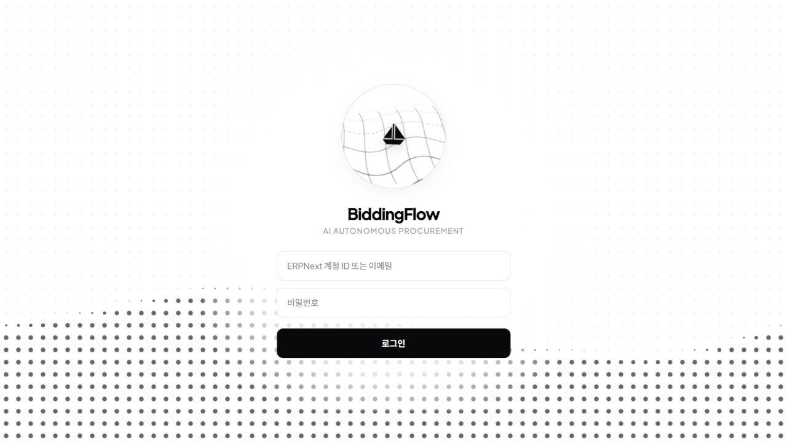

*로컬에서 실행한 프론트엔드 로그인 화면. 로그인 후 구매 업무 화면은 이번 촬영에 포함하지 않았습니다.*

**BiddingFlow는 견적 요청, 견적서 읽기, 업체 비교, 발주 승인까지 구매 담당자의 반복 업무를 AI 에이전트가 이어 주는 ERP 연동 플랫폼입니다.** 2026년 8월부터 9월까지 팀으로 진행했습니다.

**구조를 한 줄로.** 업체가 보낸 견적서 파일을 AI가 읽어 표로 정리하고(자체 학습한 시각 언어 모델을 RunPod에 올려 사용), 결과는 웹훅으로 ERPNext에 전달되며, 사람이 판단해야 하는 지점에서는 담당자가 확인·수정하고 최종 승인은 사람이 합니다.

**내 역할**

- 프론트엔드: 통합 작업함, 단계별 구매 워크플로우 화면, 진행 상황과 판단 근거 타임라인, 도움말 챗봇 화면을 개발했습니다.
- 백엔드 일부: 업무 흐름 API, ERP 로그인 사용자 연동, 관리자용 구매 정책과 이메일 수신 허용 목록 관리, 견적 추출 결과를 안전하게 받는 웹훅 연결.
- 배포와 운영: AWS 배포 자동화, GitHub Actions 배포, HTTPS 인증서 갱신 자동화, 배포 알림을 맡았습니다.

**설계에서 지킨 원칙.** 담당자가 늘 확인하는 화면은 한 줄 띠(스트립) 형태의 작업함으로 두고, 사람이 판단해야 하는 곳에서만 구조화된 입력창을 띄우며, 최종 승인은 끝까지 사용자에게 남겼습니다. AI가 대신 결정하지 않는 지점을 명확히 정한 것입니다.

**한계.** 8월 하순의 프론트엔드 개요 문서 기준으로는 화면 대부분이 목업이었고, 9월에 실제 API와 연결했습니다. 시각 언어 모델 학습과 서빙은 다른 팀원이 주로 맡았고, 저는 그 결과를 시스템에 안전하게 연결하는 부분을 맡았습니다.

**기술**: TypeScript, Python, ERPNext, PostgreSQL, RunPod Serverless, AWS, GitHub Actions

## USD — 매번 다른 시장을 AI가 만드는 주식 생존 게임

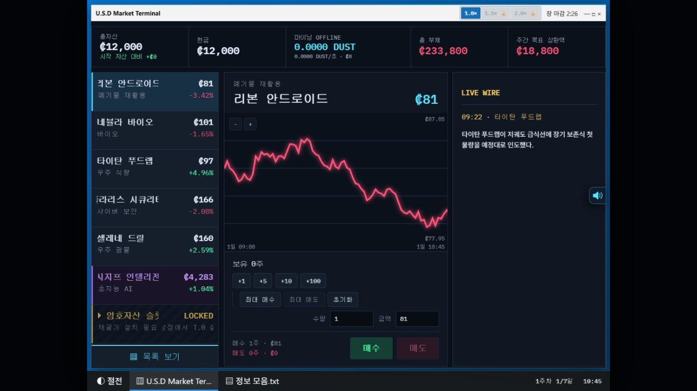

*배포된 게임에서 새 게임을 시작한 뒤 촬영한 1일차 거래 화면.*

게임 시작 화면 보기

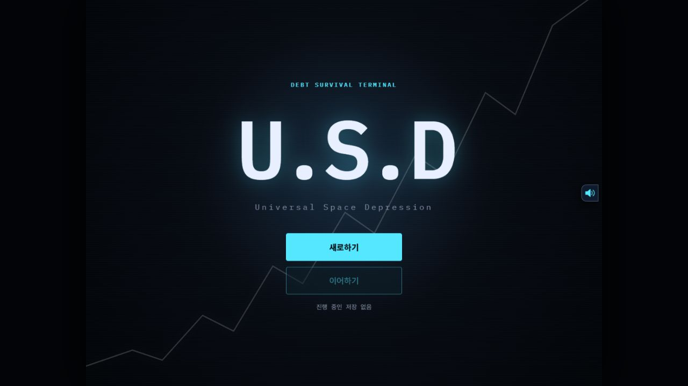

**USD는 빚을 갚을 때까지 실시간 주식 거래로 살아남는 로그라이크 웹게임입니다.** 하루는 4분의 낮 장과 시간 제한 없는 밤으로 구성되고, 한 주는 7일입니다. 주마다 빚을 갚아 나가며 6주차 상환에 성공하면 클리어입니다. 시장의 사건과 뉴스는 LLM이 매 플레이마다 새로 만듭니다.

**핵심 설계: 순서를 고정해 생성합니다.** 전체 시나리오의 큰 사건을 먼저 정하고, 그 다음 주별 사건, 마지막으로 뉴스를 만들며 각 단계의 확률은 앞에서 정한 사건에 따라 정해집니다. 하위 에이전트를 여러 개 둔 구조도 해 보았지만, 더 단순한 순차 생성이 품질과 비용 모두 더 나았습니다.

**측정하고 고친 것.** 비문율, 토큰 비용, 응답 시간 세 가지를 두고 개선했습니다.

- 사용하지 않는 더미 출력 필드를 지워 출력 토큰을 약 50% 줄였습니다.
- 모델을 업그레이드해 비용과 응답 시간을 각각 약 20% 줄였습니다.
- 시장 API가 실패해도 플레이가 이어지도록 로컬 생성기로 자동 대체합니다.

**속도와 한계.** 파일럿은 2026년 8월 8일부터 11일까지 사흘 만에 완성해 배포했고, 이후 공개판을 다듬었습니다. 하지만 플레이마다 LLM을 호출하는 토큰 비용 때문에 불특정 다수에게는 열지 않고 있습니다. 생성 품질을 지키면서 비용을 낮추는 방법이 아직 숨은 과제입니다.

**기술**: React, Vite, Zustand, Canvas, Vercel Functions. [플레이 페이지](https://usd-public.vercel.app/)

## 치매정보알리미 — 보호자를 위한 AI 상담·안내 서비스

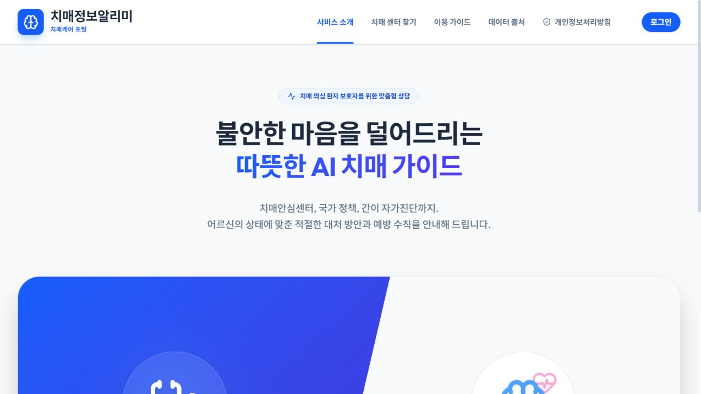

*배포 서비스의 공개 소개 화면을 촬영했습니다. 상담 기능은 로그인이 필요합니다.*

**치매정보알리미는 보호자가 걱정하는 어르신의 상태를 대화로 듣고, 치매안심센터와 대처 방법을 안내하는 서비스입니다.** 2026년 7월부터 8월 초까지 팀으로 만들었고, 백엔드는 LangGraph와 벡터·그래프 DB, FastAPI, 화면은 React와 Supabase로 구성했습니다.

**내 역할.** 프론트엔드 화면과 백엔드 API 연동을 맡았습니다. 백엔드의 설계와 모델 부분은 다른 팀원의 작업입니다.

**배운 점.** 치매처럼 오판의 비용이 큰 영역에서는 "AI가 말해도 되는가"가 기능보다 먼저 정해져야 한다는 점을 이 프로젝트에서 직접 보았습니다. 이 경험이 이후 BiddingFlow에서 '최종 승인은 사람에게'라는 원칙으로 이어졌습니다.

**기술**: React, Supabase, LangGraph(백엔드 연동). [배포 페이지](https://dementia-front.vercel.app)

## 그 밖에 만든 것들

| 프로젝트 | 무엇인가 | 내용 |
| --- | --- | --- |
| [apple-online](https://apple-online.vercel.app) | 최대 4인 실시간 멀티플레이 웹게임 | 2026년 7월 말 약 일주일 동안 만든 프로젝트. WebRTC 직접 연결, 인원수별 리더보드, fly.io에서 GCP로 서버 이전. 클라이언트 저장소 커밋 92개를 제가 작성 |
| [MDViewer](https://md-viewer-drab.vercel.app) | 브라우저 전자책 리더 | EPUB·Markdown·텍스트를 서버 업로드 없이 읽고, 이어읽기·북마크를 지원. 링크로 공유하는 문서는 브라우저에서 암호화하고, 복호화 키는 링크 뒤쪽에만 두어 서버가 내용을 볼 수 없게 함 |
| [HeadHandLeg](https://github.com/Uranium10/HeadHandLeg) | 눈·손·발 역할을 나눠 조작하는 2.5D 협동 퍼즐 데모 | 로컬 샌드박스와 동일 브라우저 3탭 WebRTC 테스트를 구현. 원격 멀티플레이는 미배포 (Next.js, Rapier) |
| [선거 대시보드](https://voting-dashboard-front.vercel.app) | 지방선거 지도 시각화 | 7·8회 결과와 제작 당시 9회 예측 데이터를 표시하는 React 화면 + FastAPI 서버, 2026년 6월. 9회 예측값은 실제 결과가 아님 |
| [typo99](https://typo99.vercel.app), [alkanoid](https://alkanoid-rouge.vercel.app) | 브라우저 게임 소품 | 2026년 7월 짧은 기간에 만들고 배포한 게임 |
| UranEngine | C++ / Direct3D 게임 엔진 실습 | 2023년 11월부터 2024년 1월, 어소트락 게임 아카데미 과정에서 직접 구현한 엔진 |

## MiniStudio — 만드는 중인 음악 제작 도구

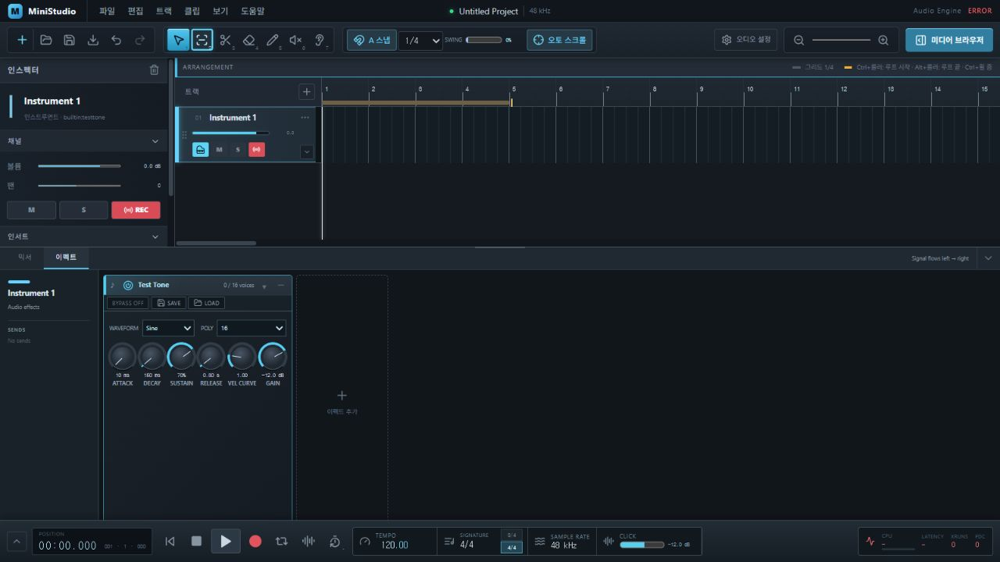

*로컬 브라우저 UI 미리보기. 네이티브 오디오 엔진은 연결되지 않아 화면에 ERROR가 표시되며, 재생·녹음 동작을 보여 주는 캡처는 아닙니다.*

**MiniStudio는 여러 소리를 쌓아 곡을 만드는 데스크톱 음악 제작 프로그램입니다.** 직접 음악을 만들어 온 경험에서 출발해, 즐겨 쓰던 제작 프로그램들의 작업 방식을 참고했습니다. 함께 만드는 DefaultSynth는 디자인 이미지를 목표로 소리를 내는 악기입니다.

**지금 상태.** 2026년 8월에 시작해 아직 완성하지 못했습니다. 음향 프로그램 분야는 사전 지식 없이 시작했고, 제가 맡은 일은 무엇을 만들지 정하고, 실제로 소리를 들어 보며 맞는지 확인하는 검증입니다.

**이 프로젝트에서 보여 드리고 싶은 것.** 익숙하지 않은 영역도 직접 확인하며 완성까지 끌고 가는 방식입니다. 배포할 때 지켜야 할 라이선스 조건도 미리 정리해 두었습니다.

## 다른 앱들의 실행 화면

### apple-online

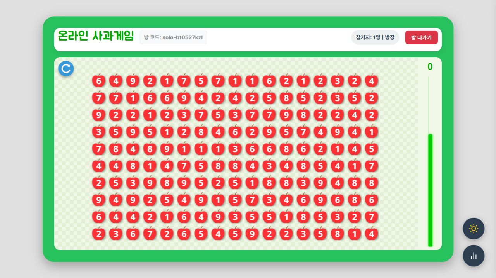

*배포 사이트의 ‘혼자 하기’ 화면. 멀티플레이 검증 화면은 아닙니다.*

### MDViewer

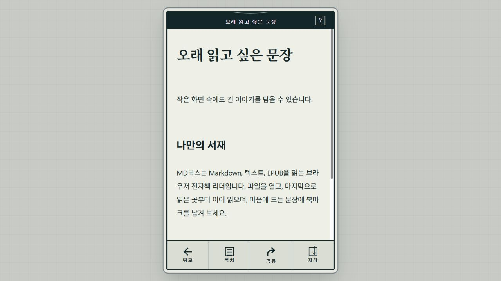

*촬영용으로 직접 작성한 예시 글을 붙여 넣어 연 화면입니다.*

### HeadHandLeg

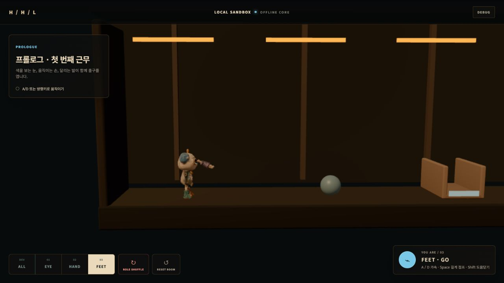

*기존 로컬 프로덕션 빌드에서 ‘바로 플레이’를 실행한 화면입니다.*

### 선거 대시보드

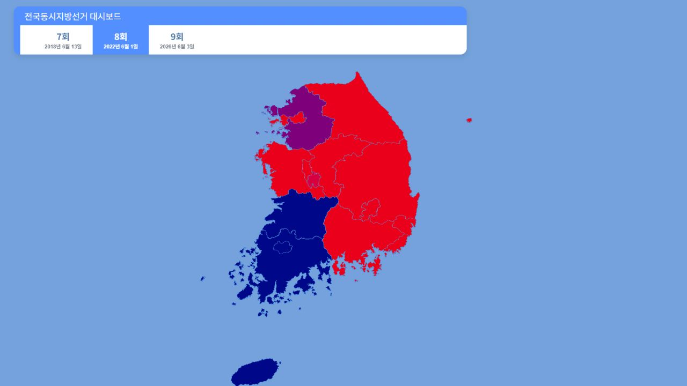

*배포된 프론트엔드에서 8회 선거 결과를 선택한 지도 화면. 9회 예측 데이터와 백엔드의 상세 조회는 이 캡처에서 확인하지 않았습니다.*

### typo99

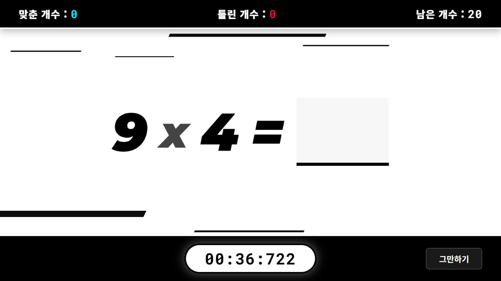

### alkanoid

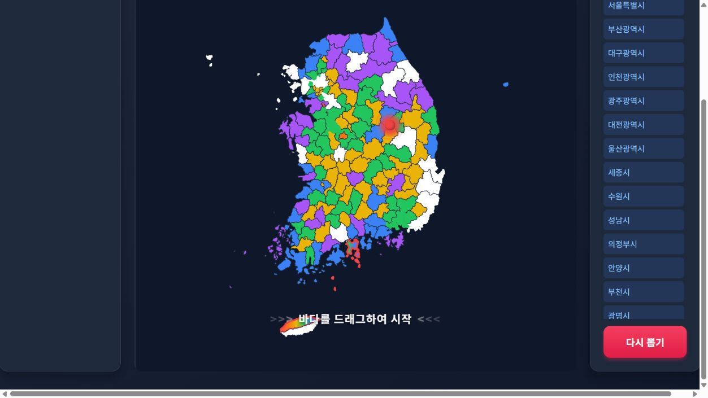

*게임을 시작하기 전의 지도와 지역 목록입니다.*
